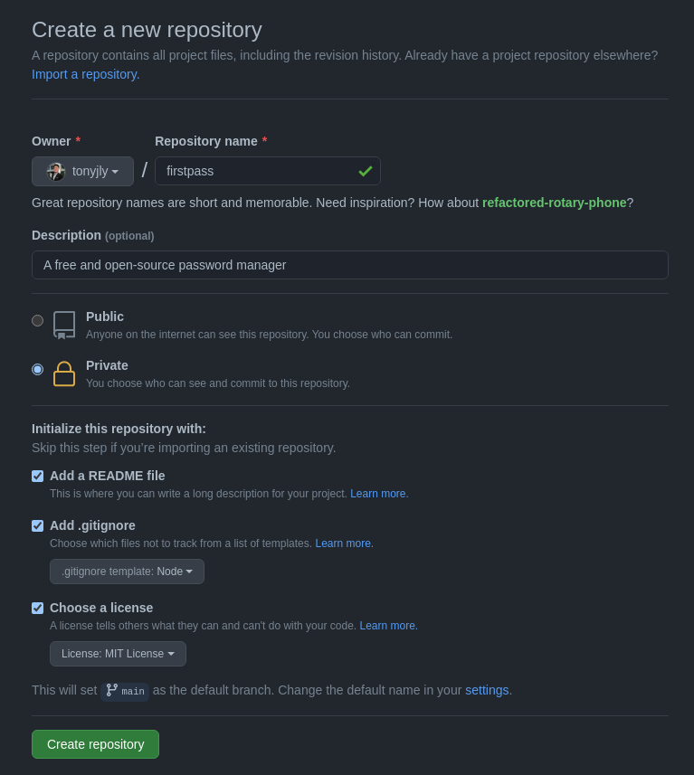

# FirstPass
## Author: Tony Ly

---

# Table of Contents
- [FirstPass](#firstpass)
  - [Author: Tony Ly](#author-tony-ly)
- [Table of Contents](#table-of-contents)
  - [Day 1 (5/18/2021)](#day-1-5182021)
      - [Initialize GitHub Repo](#initialize-github-repo)
      - [Design Tool (Bootstrap vs. Material-UI)](#design-tool-bootstrap-vs-material-ui)
      - [Selected Tools](#selected-tools)
      - [Ideas](#ideas)
  - [Day 2 (5/19/2021)](#day-2-5192021)
      - [Notes](#notes)

---

## Day 1 (5/18/2021)

#### Initialize GitHub Repo



---

#### Design Tool (Bootstrap vs. Material-UI)
- Deciding on which design tool to use: Bootstrap vs. Material-UI
- - Material-UI vs Bootstrap: A Detailed Comparison ([UX Planet](https://uxplanet.org/material-ui-vs-bootstrap-a-detailed-comparison-8fc9151db5ed)) ([Infographic](https://miro.medium.com/max/700/0*Hrk9TH0yeTiVKjMA.png))
- [React Bootstrap](https://react-bootstrap.github.io/)
  - CSS/HTML/JS framework
  - built by Twitter
  - e.g. Airbnb, Dropbox, Apple Music, Twitter, Coursera
- [Material-UI](https://material-ui.com/)
  - React UI framework
  - built by an unnamed team
  - e.g. Nasa, Amazon, Unity, Google, JPMorgan
- While I am drawn to Material-UI for its Material Design (Google), I am drawn to React Bootstrap for its higher design consistency in UX and interface
  - With this advantage, I expect to be able to focus more on developing content and features
  - Speed is important for the limited time we are afforded in our MVP project

---

#### Selected Tools
- [Create-React-App](https://create-react-app.dev/)
- [React Bootstrap](https://react-bootstrap.github.io/)
- [React](https://reactjs.org/)
- [Styled Components](https://styled-components.com/)
- [Styled Icons](https://styled-icons.js.org/)
- [Express](https://expressjs.com/en/guide/routing.html)
- [Axios](https://www.npmjs.com/package/axios)
- [React-Testing-Library](https://testing-library.com/docs/react-testing-library/intro/#!)
- [Nord Theme](https://www.nordtheme.com/docs/colors-and-palettes) (color inspiration)
- [CoreUI-React](https://github.com/coreui/coreui-react) (dashboard inspiration)

---

#### Ideas
- details table
  - password last changed date (e.g. "password last changed 32 days ago")
  - password strength (e.g. weak, medium, strong, extreme, bulletproof)
  - crack estimation (e.g. estimated time it will take to crack password, cite source)
- password generators
  - [random.org](https://www.random.org/passwords/)
  - [manytools.org](https://manytools.org/network/password-generator/)

---

## Day 2 (5/19/2021)
#### Notes
- [List Group](https://www.w3schools.com/howto/howto_css_list_group.asp)
- SSL

```bash
tony@pop-os:~/Nextcloud/HR-SEA16/mvp/firstpass$ openssl req -x509 -newkey rsa:2048 -keyout keytmp.pem -out cert.pem -days 365
Generating a RSA private key
.....+++++
.....................................................................................................................................+++++
writing new private key to 'keytmp.pem'
Enter PEM pass phrase:
Verifying - Enter PEM pass phrase:
-----
You are about to be asked to enter information that will be incorporated
into your certificate request.
What you are about to enter is what is called a Distinguished Name or a DN.
There are quite a few fields but you can leave some blank
For some fields there will be a default value,
If you enter '.', the field will be left blank.
-----
Country Name (2 letter code) [AU]:US
State or Province Name (full name) [Some-State]:Washington
Locality Name (eg, city) []:Kirkland
Organization Name (eg, company) [Internet Widgits Pty Ltd]:firstpass
Organizational Unit Name (eg, section) []:firstpass
Common Name (e.g. server FQDN or YOUR name) []:Tony Ly
Email Address []:firstpass
tony@pop-os:~/Nextcloud/HR-SEA16/mvp/firstpass$
```
- make password column full width
- jumbotron margin